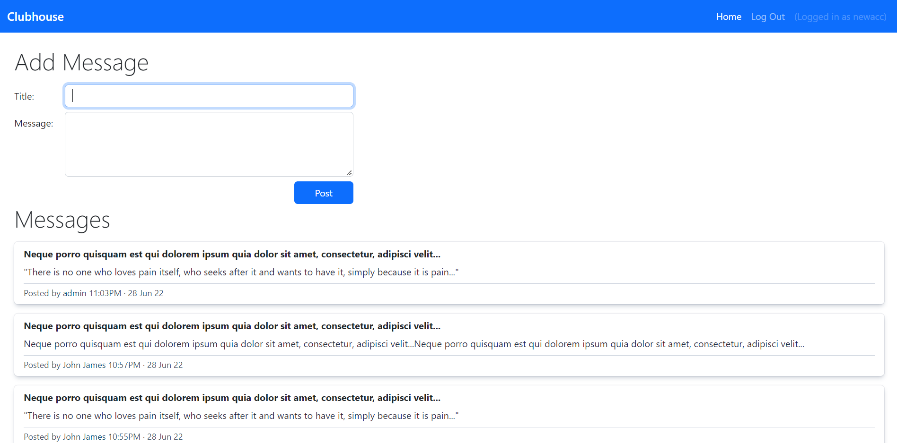

# Clubhouse

Clubhouse is a message dashboard website. Upon registration, users have the option to join the clubhouse and be a member after entering the secret password.

There are three types of users:

 1. Non-members - are welcome to `view` all messages posted in the Clubhouse, but are not able to see the authors and date when the messages are posted
 2. Members - are able to `publish` and `view` all messages posted in the Clubhouse
 3. Admins - have the ability to `publish`, `view` and `delete` messages in the Clubhouse

Secret password:  *bestclubever*

[Check out the live demo on Heroku](https://clubhouse2022.herokuapp.com/)

## Built with

- Node
- Express
- MongoDB (Mongoose)
- PassportJS and bcryptJS for local authentication
- Bootstrap 5.2

## Demo

